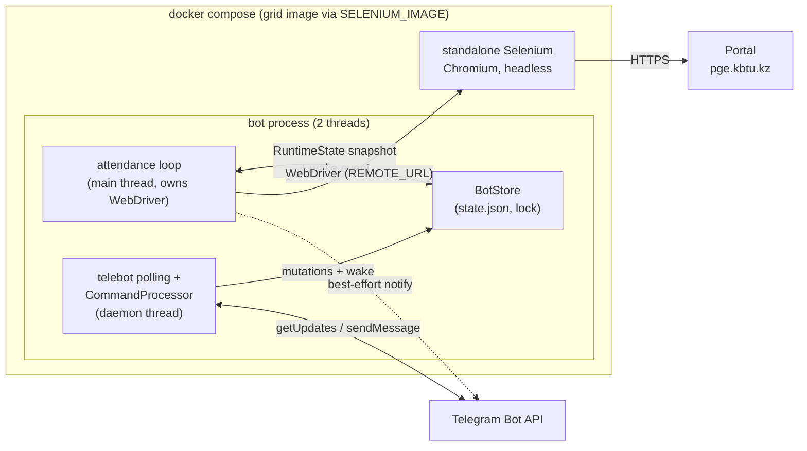

# Architecture

Documents the system as it exists today. Small project — this file is deliberately short.

## System overview

AttendBot is a two-thread Python worker that keeps a student marked as attending on a university portal during configured weekly time windows. The main thread runs the attendance loop (Selenium via a remote grid); a daemon thread runs telebot's `infinity_polling` for commands. Both meet in a thread-safe persistent store. The attendance loop deliberately has **no runtime dependency on Telegram**: notification failures and command-poll failures never stop attendance.

## Components and responsibilities

| Component | Responsibility |
| --- | --- |
| `main.py` | Composition root: settings, store (with seed), clients, threads, signal handlers, crash notification |
| `app/config.py` | Frozen `Settings` from env vars (evaluated at import time); `TG_*` required, `WSP_*`/`BASE_URL` are seeds |
| `app/store.py` | `BotStore`: thread-safe owner of credentials/base URL/schedule; atomic JSON persistence (0600); `RuntimeState` snapshots; `update_schedule` validates before commit |
| `app/schedule.py` | Schedule model: `from_toml`/`from_dict`/`to_dict`, window queries (`is_open`, `seconds_until_next_open`, `seconds_until_close`), overnight-window support |
| `app/commands.py` | `CommandProcessor` (pure command logic: parse → mutate store → reply text) + `create_telebot` (telebot handler wiring, chat-id authorization, `sch:*` callback dispatch) |
| `app/schedule_ui.py` | Stateless `/schedule` inline-keyboard editor: screens encoded in `callback_data` (≤64 bytes), re-rendered from the store; day editors, window-add wizard (hour/minute grids), paged timezone picker |
| `app/driver_factory.py` | Construct remote Chrome `WebDriver` (headless, certificate errors ignored) |
| `app/telegram.py` | `TelegramNotifier`: sync send facade over the shared `TeleBot` instance (used by the attendance thread and signal handlers) |
| `app/pages/login_page.py` | Page object for the portal login form (GWT/Vaadin selectors, multilingual button text) |
| `app/services/attendance.py` | `AttendanceService`: schedule-aware main loop, browser open/close, login check, attend click, failure recovery |

## Runtime flow

1. Compose gates the bot on the Selenium `service_healthy` check (`/opt/bin/check-grid.sh`, shipped in the grid image) → the container runs `python /bot/main.py` (CMD, PID 1 → receives signals directly).
2. `main.py` builds `BotStore` (seed chain on first start: existing state file → `WSP_*`/`BASE_URL` env seeds → built-in default schedule; `BASE_URL` has no code-level default — the loop idles until it is set), sends a Telegram startup message, builds the `TeleBot` + `AttendanceService`, starts the telebot polling daemon thread, installs signal handlers.
3. Attendance loop (poll 10 s, wait 30 s) — re-reads a `RuntimeState` snapshot **every iteration**:
   - **Paused** (`/stop`) → close driver, wait for wake.
   - **No credentials** → close driver, wait for `/login`.
   - **Outside all windows** → close driver, interruptible sleep until the next window.
   - **Base URL changed** → recreate the driver against the new URL.
   - **Inside a window** → ensure logged in → click attend → read lesson label → best-effort Telegram notify → sleep one poll.
   - All sleeps go through `Event.wait` on the shared `wake` event, so command mutations apply immediately, not after the current sleep.
4. Command thread (telebot): receive update → authorize by chat id → text commands via `CommandProcessor.execute`; `/schedule` and `sch:*` callbacks via the stateless inline editor in `schedule_ui` (screens re-rendered in place with `edit_message_text`; mutations go through `update_schedule` and set `wake`).
5. `SIGINT`/`SIGTERM` → Telegram stop message → `wake.set()` → `svc.shutdown()` (quit driver) → exit 0.

## State ownership / sources of truth

- **State file** (`STATE_PATH`, `/data/state.json` in Docker, `bot-data` volume): WSP credentials, base URL, schedule. Written atomically on every command mutation; read once at startup. This is the single source of truth — `WSP_*`/`BASE_URL` env vars are one-time seeds used only when the file is absent.
- **Paused flag**: in-memory only, deliberately not persisted — a process restart implies a fresh attendance attempt.
- **WebDriver session**: owned exclusively by the attendance thread; disposable, recreated on failure, window change, base URL change, or pause.
- No database; no other persistent stores.

## Failure and recovery

| Failure | Handling |
| --- | --- |
| Selenium grid not ready at start | `depends_on: service_healthy` gates bot startup; grid outages later are retried by `_try_open` (`restart: unless-stopped` covers container-level failures) |
| Grid unreachable when a window opens | `_try_open` logs and retries next tick — the loop never crashes on driver-open failures |
| `InvalidSessionIdException` | Quit driver, recreate, retry after poll |
| `TimeoutException` (UI element missing — e.g. already attended / page state) | `refresh()`; if refresh fails, recreate driver |
| Other `WebDriverException` | Sleep 3 s, `refresh()`; if refresh fails, recreate driver |
| Unexpected exception in loop | Log, retry after poll (loop never exits on its own) |
| Telegram polling/reply failures (command thread) | Handled and retried internally by telebot's `infinity_polling`; attendance unaffected |
| Telegram bot init failure (e.g. malformed token) | Caught at startup → attendance continues without commands/notifications (logged) |
| Command handler bug | Caught per update, error reply, polling continues |
| Credentials missing | Loop idles with driver closed until `/login` |
| `BASE_URL` missing (and not set via `/url`) | Loop idles with driver closed until it is set |
| Fatal crash / exit | Telegram "Bot crashed" message, re-raise; container restarts via `restart: unless-stopped`; state survives in the volume |
| Telegram send failure | Logged as warning; never propagates (notifications are best-effort) |

## Trust boundaries

- `bot → grid`: internal compose network only; the grid trusts anyone who can reach it — keep `REMOTE_URL` private, never expose ports.
- `grid → portal`: WSP credentials are typed into the remote browser by the bot; they travel state file → grid → portal form. The state file contains the password in plain text (0600) — treat the volume accordingly.
- `bot → Telegram`: bot token in env; only the configured `TG_CHAT_ID` may issue commands; `/login` messages remain in the chat history until the user deletes them.

## Deployment model

- `Dockerfile`: `python3.12-bookworm-slim` + uv, `uv sync --frozen`, runs as `nobody`, stdout logging (`PYTHONUNBUFFERED=1`), no exposed ports, `/data` created and chowned for persistent state, `CMD` runs Python directly (PID 1 → receives signals).
- `docker-compose.yml`: `bot` + a single `selenium` service (default `selenium/standalone-chrome:latest`, multi-arch amd64+arm64, overridable via `SELENIUM_IMAGE`), both `restart: unless-stopped`, default compose network — service names provide DNS (`http://selenium:4444`); the grid healthcheck gates the bot via `depends_on: condition: service_healthy`; `bot-data` volume mounted at `/data`.
- Coolify compatibility contract: no compose profiles (unsupported by Coolify — coollabsio/coolify#6395); all configuration interpolates from environment variables (a local `.env` or the Coolify env UI — there is deliberately no service-level `env_file`, which would be absent on Coolify); required vars (`TG_BOT_TOKEN`, `TG_CHAT_ID`) use `${VAR:?…}` so Coolify blocks deployment until they are set; no exposed ports (worker + private grid); graceful SIGTERM; non-root; persistent state in a named volume.
- Pointing `REMOTE_URL` at an external grid is supported, but the bundled `selenium` service still starts — remove it (and the `depends_on` block) in the Coolify compose editor if unwanted.

## Architectural invariants

- The WebDriver is touched only by the attendance (main) thread; command handlers go through `BotStore` + `wake` only.
- Attendance never blocks on Telegram: notifications are fire-and-forget, command polling is a separate daemon thread (transport owned by telebot, semantics by `CommandProcessor`).
- Store mutations validate before commit (`Schedule.from_dict` raises → mutation rejected, state unchanged).
- Single-threaded attendance logic; all waiting is `WebDriverWait` or the interruptible `wake` event. Do not introduce more concurrency without a stated need.
- The `Schedule` is the sole arbiter of browser up/down; `AttendanceService` owns the driver lifecycle end to end.
- The process exposes no network surface.

## Known unknowns / limitations

- Portal DOM selectors (`gwt-uid-4`/`gwt-uid-6`, `v-button primary`, `v-label-bold`) are fragile against portal UI updates; no self-test exists to detect breakage — the first symptom is Timeout loops. The `pge.kbtu.kz` default is unverified against the old `wsp` selectors.
- No tests, linting, or CI.
- `Settings` snapshots env at import time; later env changes in-process are invisible.
- Window granularity is minutes (inline editor uses a 5-minute grid); DST transitions rely on `zoneinfo` arithmetic and are untested.
